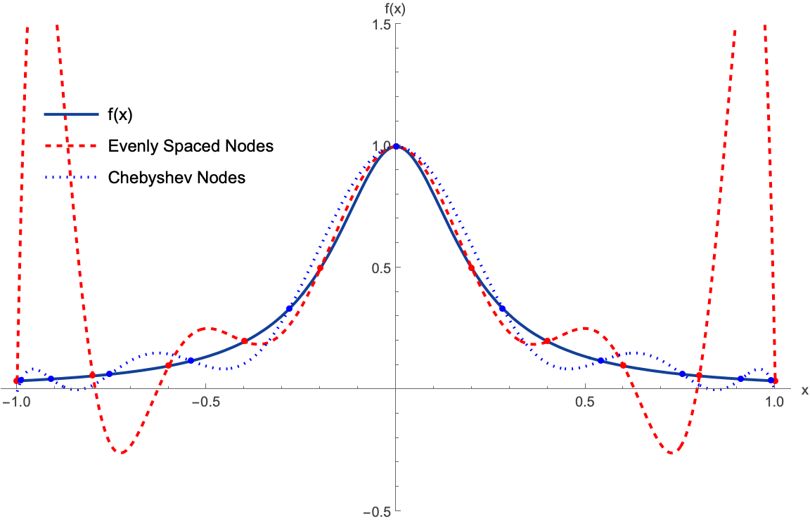

# Approximation Problem

> **手把手教你写出超过 Python 标准库的三角函数**



## 📖 简介

这是 [知乎回答：如何手写一个超过 Python 标准库的三角函数？](https://www.zhihu.com/question/1982886230745182287/answer/1988291112218169391) 的配套源代码仓库。

展示了如何通过数值逼近算法实现高精度的三角函数计算，并进一步通过 *Cython* 和 *Rust* 进行性能优化，最终给出没标准库准但比标准库快的三角函数demo实现`:-D`

## 📊 性能对比


## 📂 项目结构

| 模块            | 文件                             | 说明                               |
| :-------------- | :------------------------------- | :--------------------------------- |
| **理论推导**    | [`approx.nb`](approx.nb)         | Mathematica 笔记，包含数值推导过程 |
| **Python 实现** | [`approx_py.py`](approx_py.py)   | 原生 Python 实现                   |
| **Cython 优化** | [`approx_cy.pyx`](approx_cy.pyx) | 使用 Cython 编写的 C 扩展          |
| **Rust 优化**   | [`src/lib.rs`](src/lib.rs)       | 使用 Rust 编写的扩展               |

## 🛠️ 快速开始

### 环境依赖

* [uv](https://github.com/astral-sh/uv) (Python 包管理)
* [Rust](https://www.rust-lang.org/) (编译 Rust 扩展)
* [just](https://github.com/casey/just) (命令运行)

### 运行

如果你已经安装了 `just`，只需一行命令即可完成环境配置并运行测试：

```bash
just run
```

### 常用命令

如果你想手动执行各个步骤，可以参考 [`justfile`](justfile) 中的命令：

```bash
# 安装依赖并运行 benchmark (推荐)
just run

# 仅安装依赖
just setup

# 运行 benchmark
just benchmark

# 单独重新编译扩展
just build cython
just build rust
```
